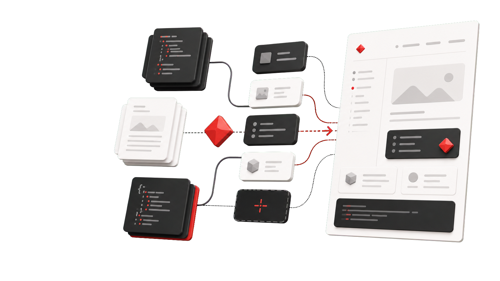
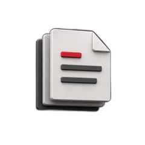
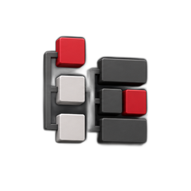
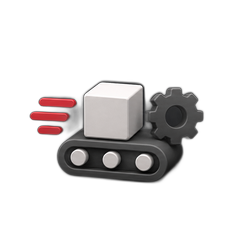
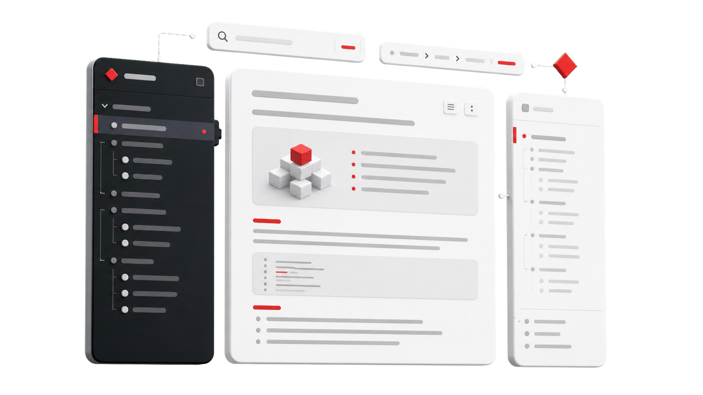
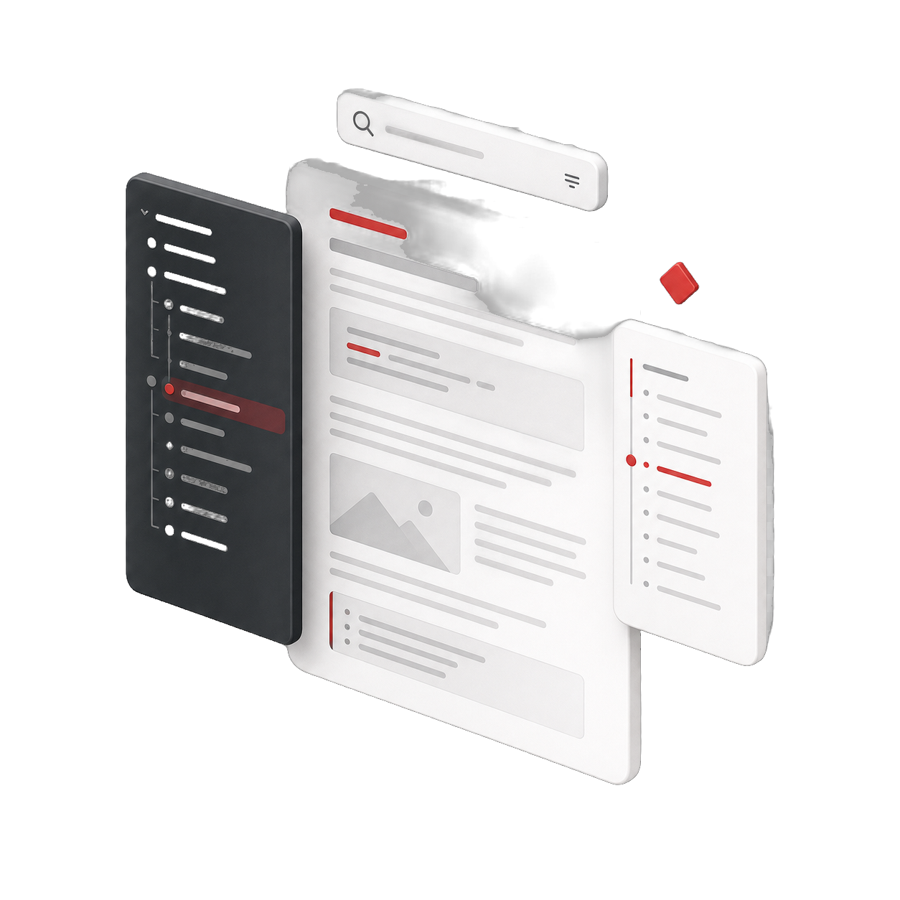

:::hero
# Документация, которую удобно писать и читать

Docara собирает документацию, справочники и продуктовые страницы из Markdown
и JSON. Авторы работают с понятными файлами, а читатели получают быстрый
статический сайт на SIMAI Framework.

[Создать первый сайт](/start/)

[Компоненты](/components/catalog/)


:::

## Начните со своей задачи

:::features
-  **[Хочу собрать первый сайт](/start/).** Пройдите от пустого каталога до проверенной страницы в браузере.
-  **[Выбираю инструмент](/authoring/layout-and-navigation/).** Посмотрите, как устроены содержание, макеты, языки и навигация.
-  **[Буду развивать проект](/development/).** Изучите архитектуру, компоненты, схемы и проверки.
:::

## Один источник — разные форматы

:::showcase
## Документация с полноценной навигацией

Preset `docs` формирует многоуровневое меню, поиск, хлебные крошки, содержание
страницы и переходы между материалами. Та же система собирает сфокусированные
лендинги без документационной оболочки.

[Разобраться в макетах](/authoring/layout-and-navigation/)


:::

## Всё важное для читателя

:::features
- **Быстро найти материал.** Дерево разделов, локальный поиск, хлебные крошки и содержание страницы сохраняют контекст.
- **Читать на любом экране.** Адаптивный макет, светлая и тёмная темы работают на общих токенах SIMAI Framework.
- **Перейти на нужный язык.** Каждый объявленный locale получает собственное дерево страниц и предсказуемые адреса.
- **Не терять место в тексте.** Содержание страницы отмечает текущий раздел, а переходы между материалами сохраняют маршрут чтения.
:::

## Всё важное для команды

:::columns
### Содержание остаётся содержанием



Markdown хранит текст, код и таблицы. JSON описывает сайт, разделы, страницы и
области. Производный каталог сборки не нужно править вручную.

---

### Компоненты работают как блоки


Типизированные компоненты расширяют Markdown, а сгенерированный каталог
показывает точный вызов, возможности и состояние компонентов текущей сборки.

---

### Макет задаётся отдельно


JSON хранит языки, области, макеты и наследование разделов отдельно от текста.
Один источник можно представить как документацию или продуктовый лендинг.

---

### Результат можно проверить


Зафиксированные revisions определяют версию SIMAI Framework. Статическая
проверка находит повреждённые страницы и локальные ссылки до публикации.
:::

## От пустого каталога до готового сайта

:::steps
1. Создайте переносимый проект и объявите языки сайта.
2. Напишите страницы в Markdown и настройте наследование через JSON.
3. Соберите статический каталог одной PHP-командой.
4. Проверьте результат в staging и публикуйте с подготовленным rollback.
:::

```shell
php vendor/bin/docara init
php vendor/bin/docara build local
php vendor/bin/docara verify-static build_local
```

[Открыть полный быстрый старт](/start/).

## Из чего собирается страница

:::columns
### Markdown

Заголовки, абзацы, списки, таблицы, код и ссылки остаются читаемыми без
специального редактора.

---

### JSON

`docara.json`, `section.json` и необязательный JSON-файл страницы задают макет,
области, навигацию, поиск и локальные переопределения.

---

### Компоненты

Docara-компоненты и допущенные Smart-компоненты SIMAI Framework добавляют
уведомления, кнопки, первый экран, шаги, колонки, Promo и другие повторяемые
блоки.

---

### Статический результат

Сборка создаёт готовые HTML, CSS, JavaScript, ассеты и служебные отчёты. Серверу
публикации не нужен PHP runtime Docara.
:::

## Система показывает, что именно она собрала

`.docara/resolved-page-plans.json` хранит эффективные настройки страницы и
происхождение значений. `_docara/component-catalog.json` фиксирует набор
компонентов, доступный в конкретной сборке.

:::card
### Что важно знать

Документация описывает проверенный локальный контур. Она не заявляет готовность
публичного релиза, поддержку каждого компонента SIMAI Framework, полностью
автономную работу без сети или интеллектуальный поиск.

:::

## Частые вопросы

:::columns
### Нужен ли Node.js?

Авторскому проекту нужны PHP и Composer. Node.js требуется разработчикам
исходных ассетов самой Docara, но не для обычной сборки сайта.

### Можно ли сделать лендинг?

Да. Режим `landing` использует тот же Markdown, JSON и компоненты, но убирает
документационную навигацию и оставляет сфокусированную продуктовую страницу.

---

### Можно ли добавить компонент?

Да. Начните с нативного Markdown, затем используйте типизированный
Docara-компонент или допущенный Smart-компонент. Для расширений есть
документированный контракт.

### Как безопасно обновляться?

Фиксируйте revision, собирайте новый каталог отдельно, сравнивайте результат и
публикуйте только после быстрой проверки с подготовленным rollback.
:::

:::promo
## Соберите первую страницу и посмотрите на результат

Начните с небольшого сайта, изучите получившийся каталог и расширяйте его
только теми компонентами, которые действительно нужны вашему содержанию.

[Перейти к быстрому старту](/start/)


:::
