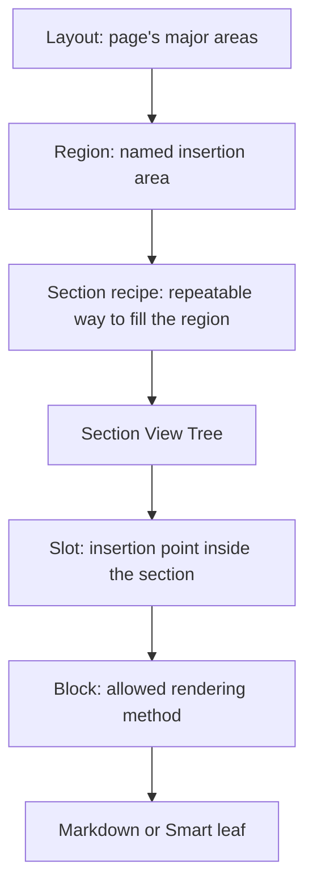
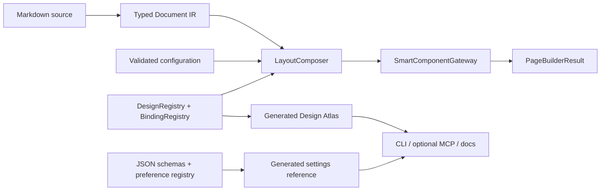

# Docara: Content, Design & Settings product track

Date: 2026-08-04
Status: `goal_b_external_dependency_blocked`
Track ID: `docara.track.content_design_settings`
Type: post-LEGO product proposal
Planning baseline HEAD: `d748eca04cd09e79ed6e2079a56b077265bcf905`
Accepted Goal 3 product candidate: `1e571b6e16ebc4520121aff0ae868de3b986dff3`
Branch: `codex/docara-unified-architecture`
Remaining unstarted goals: 1
Current canonical next action: `obtain_independently_accepted_framework_wave`

Status: `goal_b_external_dependency_blocked`
Current stage: `docara.stage.b.interface_library`
Current batch: `docara.batch.b.interface_library`
Current next action: `obtain_independently_accepted_framework_wave`
Next roadmap goal: `docara.goal.b.interface_library` (`external_dependency_blocked`, authorized=`true`)

## 0. Status and authority

This file began as the preserved user proposal requested after the component,
composition, interface and settings walkthrough. Goal 3 was independently
accepted and the user explicitly activated Goal A on 2026-08-04. The accepted
Goal A execution contract is
`source/workflow/2026-08-04-docara-goal-a-shell-contract.md`.

Goal 3 and Goal A are independently accepted. Goal B was activated and B0-B3
plus the available B5 matrix are implemented on exact candidate `ccb076a…`.
Its required Framework wave remains externally blocked. Activation and partial
implementation do not authorize:

- Goal C implementation before an independent Goal B verdict;
- rewriting the accepted Goal 3 candidate or historical evidence;
- external Framework owner repositories or sites;
- merge, push, tag, release or deploy.

The only authorized current action is:

```text
obtain_independently_accepted_framework_wave
```

### Start gate

Goal A started only after all conditions became true:

1. the current executor is idle and its worktree is reconciled;
2. Goal 3 Developer/AI SDK, including the bounded SF5 UI-radius integration, has
   an independent accepted verdict;
3. the implementation baseline, product candidate, Framework pins and current
   router are frozen to exact revisions after that audit;
4. the user explicitly activates this track;
5. the proposed decisions are represented in an accepted canonical graph
   proposal and synchronized human specification;
6. the first bounded goal has a named executor, independent auditor and exact
   evidence directory.

The independent Goal 3 and Goal A verdicts are `PASS`. Goal B remains the
active authorized goal but cannot continue until the exact independently
accepted Framework owner artifacts exist. Goal C remains unauthorized.

## 1. Track objective

Copy-ready objective for a future Goal/track:

```text
После независимого принятия текущего Goal 3 превратить Docara в понятный расширяемый конструктор контентных сайтов: разделить библиотеки контента и оболочки, сделать зарегистрированные макеты, секции и варианты интерфейса безопасно выбираемыми через существующий DesignRegistry, перевести заменяемый publisher UI в общий SmartComponentGateway, создать отдельные разделы «Дизайн и интерфейс» и «Настройки», добавить полезные недублирующие Framework- и project-демонстрации и доказать production/preview parity без второго renderer, произвольных executable paths и ослабления безопасности.
```

### Desired user outcome

A user should be able to:

1. write pages in normal Markdown;
2. insert documented inline and block Docara components;
3. use only explicitly admitted portable Framework components;
4. add project-owned content or shell components under an approved namespace;
5. choose registered layout, navigation and interface variants without editing
   Docara engine code;
6. understand every effective setting, its scope, default, source and allowed
   values;
7. preview the exact production composition before applying a change;
8. let an IDE, CI job or AI agent discover the same contracts through CLI or
   optional MCP without granting arbitrary filesystem or code execution.

### Completion gate

The track is complete only when Goals A, B and C are implemented in sequence and
each has an independent accepted verdict. Completion additionally requires:

- one public Markdown source per route;
- one typed Document IR pipeline;
- one `NodeRendererRegistry`;
- one `SmartComponentGateway`;
- one `LayoutComposer`;
- one `PageBuilder`;
- one generated Design Atlas projection over accepted registries;
- one generated settings reference over accepted schemas;
- complete component-catalog and settings coverage;
- full/single build equality, deterministic rebuilds, security negatives and
  browser/accessibility evidence;
- no unsupported Framework component presented as production-supported;
- no second public renderer, preview engine or indefinite dual path.

Do not mark the track complete while any required Done When item is red or while
an unresolved hard blocker is being described as a note.

## 2. Current factual baseline

### 2.1 Accepted and pending roadmap state

| Area | Current state at planning baseline |
| --- | --- |
| Goal 1 Portable Smart Runtime | independently accepted with notes |
| Goal 2 Design Registry/Preview | independently accepted with notes |
| Goal 3 Developer/AI SDK | implementation complete, awaiting independent audit |
| Release review | unauthorized |
| Merge, tag, release, deploy | outside this proposal |

### 2.2 Existing single production path

```text
Markdown
  -> typed Document IR
  -> NodeRendererRegistry
  -> SmartComponentGateway
  -> LayoutComposer
  -> PageBuilderResult
```

Full-site and single-page builds already converge on the same `PageBuilder`.
Preview and SDK surfaces must continue to delegate to this production path.

### 2.3 Existing composition artifacts

The current built-in composition can be inspected in:

| Concept | Existing source |
| --- | --- |
| Layout definition | `resources/layouts/docara.docs.json` |
| Layout View Tree | `resources/views/layout.docara.docs.json` |
| Article Section definition | `resources/sections/docara.article.json` |
| Article Section View Tree | `resources/views/section.docara.article.json` |
| Document Block | `resources/blocks/content.document.json` |
| Other Blocks | `resources/blocks/` |
| Declarative Section schema | `resources/schemas/declarative-section.schema.json` |
| Compilation/binding bridge | `src/Declarative/DeclarativePageCompiler.php` |
| Publisher outer page | `resources/publisher/templates/page.php` |
| Publisher chrome leaves | `resources/publisher/components/` |

The current layout/section/block/view files are real runtime definitions, not
documentation-only diagrams.

### 2.4 Existing component ownership

| Namespace | Owner and purpose |
| --- | --- |
| `ui.*` | Framework-owned portable Smart artifacts admitted by exact lock |
| `docara.*` | Docara-owned components distributed with the product |
| `project.*` | example project-owned namespace configured by a site |

The prefix is an ownership and collision boundary. It lets the provider registry
determine who owns a component, which manifest validates it and which exact
artifact supplies its views/assets. `project.*` is a starter convention, not a
mandatory universal name; a project may use another safe configured namespace,
for example `acme.*`.

At the planning baseline:

- `ui.alert` and `ui.button` are admitted Framework Smart examples;
- they remain valuable ABI/compatibility proofs but overlap common Docara
  notification/button semantics and should not be the headline product demos;
- built-in inline components include `docara.badge`, `docara.button`,
  `docara.icon` and `docara.kbd`;
- project fixture `project.notice` proves local admission but is too close to an
  alert to demonstrate the full product value;
- shell components already include `docara.brand`, `docara.navigation`,
  `docara.toc` and `docara.preferences`.

### 2.5 ABI in plain language

In this project, ABI means the portable contract between a Smart artifact owner
and a host. It is broader than a PHP method signature. It fixes:

- neutral identity and version;
- manifest structure;
- props, states and validation rules;
- views, presets, slots and templates;
- assets and hydration behavior;
- provider ownership and exact provenance;
- host compatibility and deterministic rendering expectations.

The host can consume an admitted artifact without learning a second component
dialect. Historical names may be compatibility aliases only; they do not create
another ABI.

### 2.6 Current gaps this track addresses

1. Component documentation is product-visible as a mostly flat catalog rather
   than the six user-facing entry points requested below.
2. Composition is technically documented but its insertion points are hard to
   discover from the user mental model.
3. Settings are concentrated in authoring documentation and lack a dedicated
   root with task guides and an exhaustive schema-derived reference.
4. Publisher chrome is partly registered Smart composition and partly trusted
   application templates; replaceable visual leaves are not yet presented as a
   coherent interface library.
5. Safe Section bindings are partly closed over hard-coded schema/compiler
   lists, limiting project-owned shell composition.
6. Existing Framework demos prove transport compatibility but do not yet show a
   sufficiently useful, nonduplicating scenario.
7. The CLI/MCP capability exists, but the public documentation does not yet
   explain a single discover-plan-preview-apply-validate journey for an agent.

## 3. Product model

The public documentation and configuration should present three product
layers:

1. **Content** — Markdown and leaf components placed by an author.
2. **Design & Interface** — layouts, regions, section recipes and registered
   shell variants.
3. **Settings** — typed values, scopes, inheritance, locks and diagnostics.

### 3.1 Three-level user mental model

For ordinary users, composition is explained in three levels:

```text
Layout -> named Regions -> registered Section recipes
```

Slots, Blocks, Smart components and Views remain visible in the advanced
explanation as technical insertion and leaf mechanisms:



### 3.2 Exact meaning of each term

| Entity | User question | Runtime responsibility |
| --- | --- | --- |
| Layout | What major areas make up the page? | declares named regions and selects a layout View |
| Region | Into which page area is content inserted? | insertion node in the Layout View Tree |
| Section | Which registered recipe fills this region? | selects Section View, bindings and Blocks |
| Slot | Where inside the Section View is a Block inserted? | named insertion node in the Section View Tree |
| Block | How is this content safely rendered? | admitted leaf renderer such as document, Markdown, safe element or Smart |
| Smart | Which independent UI component is the final leaf? | validated component resolved through one Gateway/provider |
| View | What safe registered structure surrounds regions or slots? | declarative tree; never an arbitrary project template path |

### 3.3 How insertion is represented

The insertion point is not an invisible convention:

1. a Layout View Tree contains a `region` node with a stable name;
2. `layout.regions.<region>.sections[]` chooses registered Section recipes;
3. a Section View Tree contains one or more named `slot` nodes;
4. a Block declares which slot it fills;
5. the Block resolves to Markdown, a safe element or a Smart leaf;
6. the selected Smart manifest validates the final props before rendering.

The future documentation must show a complete real example by linking the
layout, region, section, slot and block files side by side and displaying the
resulting page.

## 4. Decision log

These decisions are proposed and require canonical acceptance before runtime
work.

| ID | Proposed decision | Reason |
| --- | --- | --- |
| DCSI-D01 | Add three public roots: Content/Components, Design & Interface, Settings | matches the user's tasks instead of internal implementation folders |
| DCSI-D02 | Divide the component catalog into six visible entry points, including Docara containers/composition | makes authoring form, ownership and support status obvious |
| DCSI-D03 | Keep `ui.alert`/`ui.button` as compatibility proof, not headline useful demos | avoids teaching duplicates as the main extension value |
| DCSI-D04 | Support project components in two safe roles: content leaves and admitted shell contributions | enables site-specific value without executable paths |
| DCSI-D05 | Treat publisher chrome as an interface library of registered replaceable leaves | enables controlled site composition |
| DCSI-D06 | Use one semantic component with registered Views/presets for visual variants | avoids component-ID switches and namespace renderer branches |
| DCSI-D07 | Generate a Design Atlas from existing registries | prevents a second registry or source of truth |
| DCSI-D08 | Replace closed binding enums/matches with a safe provider-owned binding registry | enables extension without editing the compiler for each project binding |
| DCSI-D09 | Keep outer page and document head application-owned | protects security, metadata and build invariants |
| DCSI-D10 | CLI and optional MCP delegate to identical application services and plans | agents and humans get the same behavior |
| DCSI-D11 | Expose only allowlisted namespaces, capabilities, Views and settings | project JSON cannot introduce code paths |
| DCSI-D12 | Deliver three sequential goals with independent audits; release is a separate decision | preserves bounded work and honest readiness |
| DCSI-D13 | Model component ownership and authoring kind as independent Atlas facets | Framework/project components may also be inline, block or container without creating contradictory catalog types |

## 5. Non-negotiable invariants

1. One public page is `content/<locale>/<route>.md`.
2. Shared public UI messages are `content/<locale>/lang.json`.
3. Page prose does not move into language packs, PHP arrays or component
   manifests.
4. Markdown becomes typed in-memory Document IR.
5. There is one renderer registry, one Smart Gateway, one LayoutComposer and
   one PageBuilder.
6. Full and single-page builds use the same PageBuilder.
7. Preview uses the production composition path and cannot become an accepted
   full-build receipt.
8. Project configuration and Markdown cannot provide arbitrary PHP classes,
   callbacks, templates, filesystem paths, commands or remote URLs as runtime
   adapters.
9. Component ownership is resolved by provider/namespace policy, not renderer
   `if` statements.
10. Props, Views, presets, slots, templates, assets and hydration are validated
    before render.
11. Legacy paths are removed only after parity, zero-reference and rollback
    evidence.
12. External owner repositories and test/live sites are not modified from a
    Docara implementation goal.
13. The unrelated missing historical `ui-utilities` recovery bundle remains a
    nonclaim and cannot weaken current admission or validation.
14. A registry entry fixes whether an authored component is inline, block or
    container. Fence length only protects nested syntax and cannot promote a
    normal block into an unrestricted container.

## 6. Explicit non-goals

This track does not include:

- a drag-and-drop visual editor;
- a database-backed CMS;
- arbitrary PHP/template loading from a project;
- a second public renderer or preview engine;
- user-defined executable bindings in JSON;
- server-side form processing;
- orders, payments, CRM or product databases;
- remote package discovery during a deterministic build;
- automatic mutation of Framework owner repositories;
- merging, tagging, release, publication or deployment;
- redesigning the entire Markdown parser;
- promising that Docara can build every class of web application.

The intended product range is documentation, knowledge bases, product
information sites and registered-component landing pages. Dynamic business
systems remain outside this track.

## 7. Target architecture

### 7.1 One pipeline, more discoverable registries

The track extends current registries and application services. It does not add
parallel engines:



The Atlas and settings reference are projections. They cannot override the
registries or schemas from which they are generated.

### 7.2 Safe Binding Registry

The current closed schema/compiler bindings should evolve into a typed registry
without exposing executable project hooks.

A binding descriptor should provide, at minimum:

- stable namespaced binding ID;
- owner and provider identity;
- applicable Section/Smart IDs or declared capabilities;
- output prop names and schemas;
- settings or application-state inputs it is allowed to read;
- deterministic dependency trace;
- provenance and version;
- whether each output prop is binding-owned;
- preview/readiness status.

Registration rules:

1. Framework- and Docara-owned bindings are registered by trusted code.
2. A project may select an admitted binding by ID.
3. Project JSON may not name a class, callback, method, file or template.
4. Duplicate IDs, namespace conflicts and incompatible output schemas fail
   closed.
5. A binding cannot read arbitrary filesystem or environment values.
6. Binding output must pass both descriptor schema and final Smart manifest
   schema.

Proposed prop merge order:

```text
manifest defaults
  -> preset defaults
  -> View defaults
  -> validated static project props
  -> binding-owned props
  -> final manifest validation
```

Static project configuration cannot spoof a binding-owned prop. If a collision
exists, validation fails with source/provenance diagnostics.

### 7.3 Generated Design Atlas

The Design Atlas is a deterministic read model over:

- DesignRegistry;
- Smart provider registry;
- Binding Registry;
- admitted Framework lock;
- project-local design sources;
- preview/readiness results.

Each Atlas entry should expose:

- artifact kind: layout, View, Section, Block, Smart, binding or preset;
- component authoring kind where applicable: Markdown, inline, block or
  container;
- stable ID;
- owner/provider/namespace;
- public syntax and fence guidance without treating colon count as the type;
- applicable regions, slots and capabilities;
- available Views and presets;
- prop schema and safe examples;
- for a container: admitted child IDs/kinds, slot mapping, minimum/maximum child
  count, maximum nesting depth and order policy;
- assets/hydration declarations;
- source provenance and exact artifact revision;
- support state: supported, compatibility proof, project example, external
  proposal or rejected;
- preview references;
- dependency trace;
- deprecation/replacement information.

The same serialized Atlas is consumed by public documentation generation, CLI,
optional MCP and AI agents. No handwritten catalog may silently disagree with
runtime admission.

### 7.4 Generated settings reference

The settings reference is a deterministic projection over current JSON schemas
and the reader-preference registry. For every setting it provides:

- canonical path;
- description and example;
- scope: site, section or page;
- inheritance behavior;
- default;
- allowed values and validation;
- whether the value affects content, design, build or reader-local state;
- effective value and provenance in inspect/preview output;
- security notes and incompatible combinations;
- version/deprecation metadata.

Physical Markdown pages explain tasks and concepts. Generated reference tables
provide exhaustive field coverage. Generated output never becomes the source of
truth for explanatory prose.

### 7.5 Application-owned versus replaceable UI

The outer page document and `<head>` remain application-owned because they
control:

- metadata and canonical links;
- asset order and integrity;
- locale/direction;
- security-critical bootstrapping;
- build receipts and deterministic output.

Replaceable visual leaves may move through DesignRegistry and
SmartComponentGateway after parity proof. A registered component can replace a
visual leaf; it cannot replace the trusted document boundary.

## 8. Component catalog product design

The `/components/` root is divided into six visible entry points.

The navigation is intentionally user-oriented, while the machine model keeps
two independent facets:

- ownership: native, Docara, Framework or project;
- authoring kind: Markdown, inline, block or container.

The six entry points are therefore not six mutually exclusive runtime types.
A future Framework- or project-owned component may itself be inline, block or
container and remains discoverable through both facets.

### 8.1 Group 1 — Native Markdown

Purpose: show every construct actually accepted by the configured CommonMark
pipeline.

The page must be generated or tested against the real parser configuration and
include one rendered example for every supported construct category, including
only those confirmed by parser/tests. The inventory should cover, as
applicable:

- paragraphs and line breaks;
- headings;
- emphasis and strong emphasis;
- lists and task lists;
- links and images;
- inline code and fenced code;
- block quotes;
- tables;
- horizontal rules;
- any admitted extensions such as footnotes.

The page must distinguish Markdown constructs from HTML tags. “All tags” means
all supported authoring constructs, not arbitrary raw HTML. Unsafe or disabled
raw HTML receives an explicit negative example and explanation.

Acceptance requires an automated coverage check between the documented
inventory and parser fixtures so a newly enabled/disabled extension cannot
silently make the page stale.

### 8.2 Group 2 — Inline Docara components

Initial visible set:

- `docara.badge`;
- `docara.button`;
- `docara.icon`;
- `docara.kbd`.

Each component page/index card shows:

- inline authoring syntax;
- rendered result;
- props, defaults and variants;
- accessibility name/keyboard behavior where applicable;
- ownership and support status;
- copyable minimal and practical examples;
- link to the exact manifest/Atlas entry.

### 8.3 Group 3 — Block Docara components

The index is generated from admitted Docara manifests and grouped by scenario,
not maintained as a hand list. Each block example includes:

- complete fenced authoring source;
- isolated preview;
- expected slots and nested content;
- props/Views/presets;
- responsive and theme behavior;
- accessibility notes;
- failure diagnostics for invalid props.

Inline and block families remain visually separate even if they share the
`docara.*` owner namespace.

### 8.4 Group 4 — Docara containers and composition

Public label: **Контейнеры и композиция**. Technical authoring kind:
`container`.

A container accepts admitted child components and owns their composition, for
example columns, gaps, responsive stacking, ordering or named child slots. A
child component continues to own its content semantics and accessibility.

The initial obvious example is `docara.grid`:

```markdown
::::grid {columns=3 gap=2}
:::card
First card
:::
:::card
Second card
:::
::::
```

The longer outer fence makes nested shorter fences unambiguous. It is not the
source of the component type: a normal block may also use a longer fence when
its body contains literal `:::` text. The registry/Atlas `authoring_kind`
decides whether a component is a container.

Every container entry must declare and document:

- allowed child IDs and/or authoring kinds;
- required named slots, if any;
- minimum and maximum child count;
- maximum nesting depth;
- whether child order is preserved or normalized;
- responsive composition behavior;
- accessibility responsibility shared between parent and children;
- stable diagnostics for an unsupported child, illegal depth, invalid count,
  mismatched/unclosed fence or invalid child props.

Only components with an explicit admitted child contract appear in this group.
A layout-related catalog category or a `::::` example alone is insufficient.

Required container verification includes:

- admitted parent/child rendering;
- rejection of an unsupported child;
- rejection of illegal depth and count;
- preservation of declared child order;
- deterministic parsing of nested and literal fences;
- mismatched and unclosed fence diagnostics;
- responsive, theme and accessibility preview;
- full/single and preview/production equality.

Do not call these “Layout components” in public documentation. `Layout` already
means the page-level structure with Regions; a content container operates
inside authored content.

### 8.5 Group 5 — SIMAI Framework components

This group shows only exact admitted portable components.

Support labels:

| Label | Meaning |
| --- | --- |
| Supported | exact manifest/pin, validation and cross-host evidence are green |
| Compatibility proof | admitted mainly to prove the portable ABI |
| External proposal | useful candidate, not yet available to Docara |
| Rejected/superseded | visible only in diagnostics/history, never as an authoring option |

`ui.alert` and `ui.button` remain documented as compatibility proof. The useful
nonduplicating owner wave proposed for future acceptance is:

1. `ui.input` — filter/search or value-entry control in an interactive example;
2. `ui.dropdown` — version, locale or installation-method selection;
3. `ui.checkbox` — opt-in feature or generated-command option;
4. optional `ui.textarea` — editable source/snippet input;
5. optional `ui.modal` — detailed help or focused configuration result.

The first three are the recommended minimum useful wave. Before Docara lists
them as supported, the Framework owner must provide portable v1 manifests,
exact revisions, cross-host parity and independent acceptance. Their raw
presence in an SF distribution or lock inventory is insufficient.

A duplicate review compares each candidate with Docara components by user
scenario and semantics. A candidate that merely repeats an existing Docara
component remains an ABI fixture or is omitted from the showcase.

### 8.6 Group 6 — Custom/project components

Project examples represent components that a site owner can add without
modifying Docara engine source.

Two content examples are proposed:

#### `project.install_builder`

For documentation:

- choose operating system;
- choose installation method;
- toggle admitted options;
- generate an escaped copyable command;
- update locally without network or command execution.

This demonstrates useful state, Framework controls and safe output while
remaining a static-site component.

#### `project.product_configurator`

For a product/landing site:

- choose a product or tariff variant;
- choose local options;
- calculate/display a local summary;
- generate a shareable or copyable configuration if safely supported.

It has no order creation, payment, CRM, database or server-side pricing.

One shell example is proposed:

#### `project.footer_links`

- contributes only to an admitted footer region/slot;
- uses registered Views and safe props;
- proves that a site can add a shell component without a `src/` change;
- cannot replace `page.php`, `<head>` or load a project template path.

`project.notice` remains a minimal SDK/fixture example, not the headline
showcase.

## 9. Design & Interface library

### 9.1 Product purpose

The `/design/` root explains and previews the site shell separately from
content components. It should answer:

- which component renders branding, navigation, sidebar, outline, search,
  breadcrumbs, pager, preferences and footer;
- which variants are installed;
- which regions and bindings they require;
- how to select a registered variant;
- which parts are application-owned and cannot be replaced;
- how a project contributes a safe shell component.

### 9.2 Current-to-target interface matrix

Names marked “proposed” require the Goal A naming freeze and are not current
support claims.

| Interface responsibility | Current implementation | Target product surface |
| --- | --- | --- |
| Brand/logo/title | `docara.brand` | keep; document Views `default`, `compact`, `logo`, `text` |
| Primary navigation | `docara.navigation` | keep one semantic ID; expose registered `header`, `tree`, `compact` variants |
| Sidebar navigation | `docara.navigation` tree View | package as a registered Section/layout preset |
| Mobile navigation | publisher chrome + navigation composition | reuse `docara.navigation` compact View through the same Gateway |
| Table of contents | `docara.toc` | keep; document default/compact and desktop/mobile placement |
| Reader preferences | `docara.preferences` | keep; document default/side-panel |
| Search dialog | trusted publisher component | proposed `docara.search` replaceable leaf |
| Breadcrumbs | trusted publisher component | proposed `docara.breadcrumbs` replaceable leaf |
| Previous/next pager | trusted publisher component | proposed `docara.pager` replaceable leaf |
| Header actions | trusted composition | compose admitted search/preferences leaves; avoid a second component registry |
| Footer | layout/project-dependent | registered built-in recipe plus `project.footer_links` example |
| Document head/outer page | trusted application templates | remain application-owned |

### 9.3 Three navigation presentations

One semantic `docara.navigation` should provide at least:

1. horizontal/header navigation (`header`);
2. sidebar/tree navigation (`tree`);
3. compact/mobile or drawer navigation (`compact`).

Selection occurs through a registered layout/Section recipe, View or preset.
The renderer does not switch on component ID or namespace. The Atlas declares
where each presentation can be used and which binding supplies navigation
items.

The default remains backward compatible. Projects may choose another admitted
presentation without editing engine code.

### 9.4 Safe project shell contributions

A project shell contribution must declare:

- project namespace and provider;
- target admitted region/slot capability;
- registered Section/Block/Smart IDs;
- validated props and optional admitted binding;
- assets/hydration within normal Smart policy;
- preview and provenance.

Candidate shell capabilities to freeze in Goal A:

- brand;
- primary-navigation;
- secondary-navigation/sidebar;
- header-actions;
- outline/toc;
- content-before;
- content-after;
- footer.

The capability list is allowlisted and versioned. It is not a template path or
an arbitrary DOM selector.

## 10. Settings information architecture

Create a root navigation section **Настройки** with physical Markdown task
guides and schema-derived reference tables.

Proposed routes:

```text
/settings/
/settings/levels-and-inheritance/
/settings/site/
/settings/section/
/settings/page/
/settings/locales-and-routing/
/settings/branding-and-theme/
/settings/layout-and-regions/
/settings/navigation/
/settings/search-and-reading/
/settings/reader-preferences/
/settings/framework-lock-and-providers/
/settings/security/
/settings/diagnostics-and-provenance/
```

### 10.1 Required content by page

| Route | Required outcome |
| --- | --- |
| `/settings/` | map all setting families, scopes and safe editing workflow |
| `levels-and-inheritance` | site -> section -> page merge, effective-value provenance and reset behavior |
| `site` | site-only keys, content root, base URL, locales, documentation version and redirects |
| `section` | allowed section-level overrides and examples |
| `page` | front matter/page overrides and restrictions |
| `locales-and-routing` | locale routing, default locale, redirects and UI translation source |
| `branding-and-theme` | brand, theme, modal blur and Framework-owned UI radius presets |
| `layout-and-regions` | layout key, container, gaps, region recipes and safe extension |
| `navigation` | visibility/order, header navigation and registered menu presentation |
| `search-and-reading` | search indexing, breadcrumbs, TOC, mobile TOC and pager |
| `reader-preferences` | local reader controls, storage, allowlist and accessibility |
| `framework-lock-and-providers` | exact pins, namespaces, provider ownership and support status |
| `security` | forbidden paths/callbacks/raw CSS, roots and fail-closed behavior |
| `diagnostics-and-provenance` | inspect effective config, source location, schema and CLI/MCP diagnostics |

### 10.2 Existing setting families to preserve

The new IA must cover, without silently renaming behavior:

- site-only Framework lock, content root, base URL, default locale, locales,
  locale routing, documentation version, redirects, reader preferences and
  Smart namespace;
- site/section/page preset, branding, layout, settings, navigation, header
  navigation, search and reading;
- branding title, label, logo variants, favicon, mode and size;
- layout key, container maximum, scrollbar, content gap and regions;
- theme, modal blur and UI radius;
- navigation hidden/order and header items;
- search enable/index status;
- breadcrumbs, TOC, mobile TOC, TOC depth and previous/next.

The exhaustive list is generated from accepted schemas rather than copied into
an unverified hand-maintained table.

## 11. Public documentation map

### 11.1 Components

```text
/components/
  /components/markdown/
  /components/docara-inline/
  /components/docara-blocks/
  /components/docara-containers/
  /components/framework/
  /components/project/
```

Existing individual component routes remain stable where practical. The group
pages are indexes/projections, not duplicate prose owners.

### 11.2 Design & Interface

```text
/design/
  /design/composition/
  /design/atlas/
  /design/layouts-and-regions/
  /design/shell/
  /design/branding/
  /design/navigation/
  /design/sidebar-and-toc/
  /design/search/
  /design/breadcrumbs-and-pager/
  /design/reader-preferences/
  /design/footer/
  /design/project-shell/
  /design/preview-and-qa/
```

### 11.3 Settings

Use the routes from section 10.

### 11.4 Route migration policy

Before moving any current page, create a route/source inventory. Each old page
chooses exactly one outcome:

1. remain the canonical physical Markdown source and receive clearer inbound
   links;
2. move once to the new canonical route and add a validated safe redirect;
3. split only when each resulting page owns nonduplicated prose and the old
   route redirects to the correct overview.

Candidate moves to validate:

| Current route | Proposed canonical destination |
| --- | --- |
| `/authoring/configuration/` | `/settings/` |
| `/authoring/inheritance/` | `/settings/levels-and-inheritance/` |
| `/authoring/reader-settings/` | `/settings/reader-preferences/` |
| `/authoring/branding/` | `/design/branding/` with settings cross-link |
| `/authoring/regions/` | `/design/composition/` or `/design/layouts-and-regions/` |
| `/authoring/layout-navigation/` | `/design/navigation/` with settings cross-link |

Developer-specific Smart and extension guides remain under `/development/` and
link to the product-facing catalog. Public prose must not exist in two physical
Markdown owners.

## 12. Human, CLI and AI workflow

### 12.1 How an agent learns what to do

An agent should not infer hidden conventions from examples alone. It discovers
the product through:

1. repository/CLI doctor and current version;
2. generated Design Atlas and settings reference;
3. component/layout/Section/binding inspect and schema output;
4. explicit capability and provenance fields;
5. structured diagnostics with stable codes and source locations;
6. a documented plan/apply protocol;
7. production-path preview and validation results.

The optional MCP server is a transport adapter over the same application
services. It is not a separate intelligence layer or renderer.

### 12.2 Target operation sequence

```text
discover
  -> inspect schema/capabilities/provenance
  -> create dry-run plan
  -> preview through production composition
  -> review exact diff and plan hash
  -> hash-bound apply inside fixed project root
  -> validate
  -> targeted single-page or required full build
  -> QA/evidence
```

### 12.3 Required safety properties

- CLI and MCP return equivalent structured results for equivalent calls.
- MCP is read-only by default.
- Writes require explicit server permission and an operation that is itself
  admitted by application services.
- Project root is fixed and canonicalized; traversal and symlink escape fail.
- Apply requires the exact finalized plan hash and rejects stale input.
- Preview cannot write accepted build receipts or mutate normal output.
- Registry, lock or shared configuration changes require the full-build scope
  determined by the application service.
- An agent cannot pass a PHP class, callback, executable template, arbitrary
  CSS or command as a setting.
- Human-readable output and JSON output share diagnostic codes and semantics.

### 12.4 Public agent guide

Goal C adds one practical guide that demonstrates:

1. list installed component/design/settings capabilities;
2. inspect a navigation variant;
3. scaffold a project component;
4. validate it;
5. generate a dry-run configuration change;
6. preview the result;
7. apply the exact plan;
8. run the required targeted/full checks;
9. interpret a rejected unsafe operation.

The example must work both with CLI and optional MCP without changing the
underlying service contract.

## 13. Ownership and review model

The stale installed Docara skill remains disabled and is not a source of truth.
Future execution routes through current repository sources and active
federation owners.

| Responsibility | Primary owner | Required review/gate |
| --- | --- | --- |
| Track/process, sequencing, handoff | teamlead | independent auditor |
| Runtime registries, bindings, composition | dev | tester |
| Public documentation architecture and prose | docs | UX + tester |
| Interface variants and usability | UX consultation | tester |
| Canonical graph decisions/context | graph | accepted decision before activation |
| Framework portable component owner wave | SF5/Framework owner in external bounded workflow | independent cross-host acceptance |
| Redirects/indexable public docs | docs with SEO consultation | static/link/browser gate |
| Security/root/hash-bound apply | dev | tester; ops only if future live/release boundary |
| Release/deployment | not part of this track | separate user decision and preflight |

No Docara goal writes to Framework owner repositories. It only consumes exact
independently accepted artifacts.

## 14. Sequential goal queue

```text
Goal A — Shell Contract & Safe Configuration
  -> independent audit
Goal B — Full Interface Library & Useful Extension Demos
  -> independent audit
Goal C — Public Documentation, Settings Reference & Agent Journey
  -> independent audit
Separate future decision — release review / merge / tag / deploy
```

Goal B cannot start until Goal A is independently accepted. Goal C cannot start
until Goal B is independently accepted.

## 15. Goal A — Shell Contract & Safe Configuration

### 15.1 Copy-ready goal

```text
Goal A — Shell Contract & Safe Configuration. На принятом после Goal 3 baseline реализовать безопасный расширяемый контракт оболочки Docara: заменить закрытый список Section bindings типизированным provider-owned BindingRegistry без project callbacks/paths, описать capability model для shell-регионов, провести один вертикальный срез через существующий docara.navigation с вариантами header/tree/compact и доказать project-owned shell contribution без изменения engine src. Сохранить один Markdown/IR/renderer/Gateway/LayoutComposer/PageBuilder path, production/preview parity, полный fail-closed validation и обратную совместимость. Синхронизировать specification, graph proposal, handoff и fresh evidence; остановиться на ready_for_independent_audit без Goal B, release или deploy.
```

### 15.2 Required outcome

Goal A proves that interface composition is safely extensible before migrating
more publisher chrome:

- bindings are registered, typed and provenance-aware;
- project config selects admitted IDs only;
- one navigation component supports three registered presentations;
- a project shell fixture contributes through an admitted capability;
- production, preview, full and single-page paths remain one pipeline;
- current sites render identically unless a new variant is explicitly selected.

### 15.3 Milestones and bounded batches

#### A0 — Baseline, inventory and naming freeze

- freeze exact Docara/Framework revisions after Goal 3 audit;
- inventory all binding enum/match references and publisher shell call sites;
- freeze binding descriptor schema and merge order;
- freeze shell capability IDs;
- confirm proposed `docara.search`, `docara.breadcrumbs` and `docara.pager`
  names for Goal B or choose replacements;
- map current navigation Views/presets and expected HTML/accessibility.

Output: accepted decision proposal, source map and negative-reference baseline.

#### A1 — Binding Registry foundation

- add trusted binding descriptor/registry contracts;
- migrate current built-in bindings without changing output;
- update schema validation to resolve admitted binding IDs;
- add duplicate, namespace, capability, prop-collision and provenance failures;
- emit structured diagnostics and dependency traces;
- keep project JSON data-only.

Output: focused unit/security tests and byte-equality evidence for migrated
built-ins.

#### A2 — Navigation vertical slice

- represent header, tree and compact navigation as registered Views/presets or
  Section recipes of one semantic `docara.navigation`;
- select them through validated design configuration;
- use registered navigation binding, not compiler component-ID branches;
- preview all three through the production composer/Gateway;
- preserve default HTML and behavior.

Output: desktop/mobile, keyboard, theme and direction preview matrix.

#### A3 — Project shell fixture

- add a project-local `project.footer_links` or equivalently approved fixture;
- admit it through project provider/namespace policy;
- place it in an allowlisted shell capability;
- prove no `src/` change is needed to install the fixture;
- prove arbitrary path/class/callback attempts fail.

Output: consumer fixture, provenance trace and negative security evidence.

#### A4 — Integration, parity and legacy reference audit

- run focused and full tests;
- compare old/default HTML, assets and metadata;
- compare full and representative single-page builds;
- run two independent deterministic builds;
- test preview/production artifact equality;
- inventory runtime references to superseded binding branches;
- remove only code proven zero-reference with rollback.

Output: integration matrix and rollback-ready diff.

#### A5 — Governance and independent-ready handoff

- synchronize human specification, accepted graph objects and mappings;
- regenerate/check AI context;
- record exact commands, revisions, hashes and diagnostics;
- update active router only as part of the authorized Goal A workflow;
- stop at `ready_for_independent_audit`.

Output: self-contained Goal A evidence index and auditor entry point.

### 15.4 Allowed implementation surfaces

Exact paths are frozen at A0, but the expected scope is limited to:

- declarative binding/registry contracts under `src/Declarative/`;
- current compiler/schema integration;
- registered layouts, Views, Sections, Blocks, Smart manifests and project
  fixtures;
- application-service inspect/preview projections needed for the new registry;
- focused and regression tests;
- authorized specification/graph/workflow/evidence synchronization.

### 15.5 Forbidden surfaces/actions

- second parser, renderer, Gateway, composer or PageBuilder;
- arbitrary project adapter code;
- external Framework owner writes;
- public/test/live site mutation;
- mass publisher chrome migration reserved for Goal B;
- documentation IA migration reserved for Goal C;
- merge, push, tag, release or deploy;
- legacy deletion without zero-reference/parity/rollback proof.

### 15.6 Goal A Done When

1. Every current built-in binding is represented by a typed descriptor.
2. No runtime binding selection depends on a closed component-ID/namespace
   switch in the compiler.
3. Current default output is byte-identical or every intentional delta has an
   accepted fixture and explanation.
4. `docara.navigation` renders header, tree and compact presentations through
   one Gateway/provider path.
5. A project shell fixture is installed without editing engine `src/`.
6. Project config cannot introduce a class, callback, template path, arbitrary
   filesystem path or binding-owned prop.
7. Duplicate IDs, namespace conflicts, unsupported capabilities, prop
   collisions, symlink/path escapes and invalid final props fail closed.
8. Atlas/inspect output exposes binding provenance and dependency trace.
9. Full/single equality, two-build determinism and preview/production parity
   pass.
10. Existing public routes and shell browser behavior do not regress.
11. Specification, graph, handoff and evidence point to one exact candidate.
12. An independent auditor can reproduce the result from the handoff without
    executor-only context.

### 15.7 Required checks/evidence

At activation, exact commands are copied from the accepted repository contract.
Minimum classes of proof:

- `composer validate --strict`;
- formatter/static checks used by the current repository;
- focused BindingRegistry, schema, provider, project composition and
  PreviewKernel tests;
- `php vendor/bin/phpunit --do-not-cache-result`;
- `php scripts/project-context.php generate`;
- `php scripts/project-context.php check`;
- default/current HTML and asset hashes;
- full plus representative single-page build comparison;
- two clean-root deterministic builds;
- isolated previews for navigation variants and project shell fixture;
- desktop/mobile, light/dark, LTR/RTL and keyboard browser checks;
- negative fixtures for duplicate/namespace/path/symlink/callback/prop spoofing;
- zero-runtime-reference search before deletion;
- clean `git status`, exact diff inventory and rollback commit list.

### 15.8 Stop conditions

Stop and return a blocker/correction instead of widening scope if:

- Goal 3 is not independently accepted;
- a second runtime path is required to make the design work;
- safe binding ownership cannot be expressed without project executable code;
- default output changes without accepted parity evidence;
- the worktree overlaps unowned user/executor changes;
- an external owner change becomes necessary;
- the goal exceeds its allowed surfaces or cannot produce independent evidence.

## 16. Goal B — Full Interface Library & Useful Extension Demos

### 16.1 Entry gate

- Goal A independently accepted;
- exact Goal A candidate frozen;
- replaceable-versus-application-owned shell decision accepted;
- external Framework owner wave has an accepted plan and separate owner
  workflow; Docara does not implement it in the external repository.

### 16.2 Required outcome

Convert replaceable visual publisher chrome into a coherent registered
interface library, add useful project examples and consume only accepted
nonduplicating Framework artifacts.

### 16.3 Milestones

#### B0 — Design Atlas contract

- freeze serialized Atlas schema and support-state vocabulary;
- include layout/View/Section/Block/Smart/binding/preset ownership;
- expose ownership and `authoring_kind` as independent facets;
- define a machine-readable child contract for every container, including
  allowed children, slots, count, order and maximum nesting depth;
- add deterministic generation/freshness tests;
- expose the same projection to docs, CLI and optional MCP.

#### B1 — Replaceable chrome migration

- migrate search, breadcrumbs and pager as approved registered Smart leaves;
- reuse navigation, TOC and preferences components for desktop/mobile shell;
- keep outer page/head application-owned;
- avoid shell-specific renderer/Gateway/composer forks.

#### B2 — Interface variants and presets

- package coherent documentation/site/landing presets from registered pieces;
- expose three navigation presentations;
- document/preview branding, sidebar/TOC, search, preferences and footer
  combinations;
- retain a backward-compatible default.

#### B3 — Project content and shell demos

- implement `project.install_builder`;
- implement `project.product_configurator`;
- retain/complete the project footer shell example;
- keep all interactivity local, deterministic and security-reviewed;
- show how a project chooses its own namespace.

#### B4 — Framework useful-component consumption

- consume exact independently accepted portable manifests for at least
  `ui.input`, `ui.dropdown` and `ui.checkbox`, or stop at the external-dependency
  gate;
- use them in useful scenarios rather than duplicate galleries;
- verify manifest/view/preset/slot/assets/hydration before render;
- reproduce cross-host output and warnings/stderr expectations;
- keep raw-but-unadmitted SF components out of the supported catalog.

#### B5 — Integration and audit handoff

- full interface/browser/accessibility matrix;
- valid/invalid container nesting, child-order, depth/count and fence matrix;
- full/single/determinism/security/static regression;
- default-site parity and explicit-preset deltas;
- legacy publisher-leaf zero references before deletion;
- synchronized specification/graph/handoff/evidence;
- stop at Goal B `ready_for_independent_audit`.

### 16.4 Goal B Done When

1. Design Atlas is deterministic and derived only from accepted registries.
2. Ownership and authoring kind are independent fields; fence length is never
   used to infer component type.
3. Every supported container has an admitted child/slot/count/depth/order
   contract and stable invalid-nesting diagnostics.
4. Every replaceable shell leaf has an Atlas entry, owner, capability, preview
   and support status.
5. Outer page/head remain application-owned and tested.
6. Search, breadcrumbs, pager, navigation, TOC and preferences use the single
   production Gateway/composition path where replaceable.
7. Three menu presentations are safely selectable.
8. At least one project content component and one project shell contribution
   install without engine source changes.
9. Install builder and product configurator demonstrate useful static-site
   scenarios without backend side effects.
10. The minimum useful Framework wave is exact-pinned, cross-host proven and
    independently accepted before being labeled supported.
11. `ui.alert`/`ui.button` are correctly labeled as compatibility proof or used
    only where semantically appropriate.
12. Unsupported raw SF components never appear as supported choices.
13. Desktop/mobile, light/dark, LTR/RTL, keyboard and accessibility checks pass.
14. Full/single equality, deterministic rebuild, security negatives and default
    route parity pass.
15. Superseded trusted leaf templates have zero runtime references and a
    rollback path before deletion.

### 16.5 Goal B stop conditions

- Framework owner artifacts are unavailable or not independently accepted;
- migrating a leaf would require arbitrary project templates or a second
  renderer;
- the Atlas begins storing independent handwritten truth;
- container admission would rely on fence length, unrestricted children or
  unbounded nesting;
- accessibility or default parity cannot be preserved;
- a demo requires backend, network, order/payment or command execution;
- external repositories/sites would need to be changed from the Docara goal.

## 17. Goal C — Public Documentation, Settings Reference & Agent Journey

### 17.1 Entry gate

- Goal B independently accepted;
- final installed component/interface inventory frozen;
- documentation route and redirect map accepted;
- Atlas and settings reference formats stable.

### 17.2 Required outcome

Turn the accepted capabilities into a discoverable product experience with
complete component, design, settings and agent documentation.

### 17.3 Milestones

#### C0 — Documentation source and redirect inventory

- enumerate every current public Markdown route;
- choose canonical destination/redirect/keep decisions;
- prove no duplicated prose owner and no content moved into JSON;
- freeze navigation labels and ordering.

#### C1 — Six component entry points

- create group indexes for Markdown, Docara inline, Docara block, Docara
  containers/composition, Framework and project components;
- generate cards/status from Atlas;
- provide source/result/props/accessibility/failure examples;
- document container parent/child contracts and show valid nesting alongside
  unsupported-child, depth/count and malformed-fence failures;
- verify Markdown construct coverage against parser fixtures.

#### C2 — Design & Interface root

- document the three-level composition model;
- show real layout/region/Section/slot/Block files and rendered output;
- publish interface matrix and live isolated previews;
- explain menu variants and project shell contributions;
- explain application-owned page/head boundary.

#### C3 — Settings root

- create the routes in section 10;
- generate exhaustive field reference from schemas;
- add task guides for scopes, inheritance, design, navigation, reader controls,
  locks, security and diagnostics;
- expose effective value/provenance examples.

#### C4 — CLI/MCP/AI journey

- publish discover-plan-preview-apply-validate guide;
- show equivalent CLI and optional MCP outcomes;
- document read-only default, root restriction, dry-run and hash-bound apply;
- include rejected unsafe-operation examples.

#### C5 — Product demos

- provide useful Framework and project scenario pages;
- label support/proposal/compatibility states from Atlas;
- add representative screenshots/previews only from exact accepted builds;
- avoid duplicate component galleries.

#### C6 — Quality and independent-ready handoff

- build all locales/routes;
- validate source and rendered links/redirects;
- run schema/catalog coverage gates;
- compare full/single and two builds;
- run browser/responsive/accessibility/SEO smoke;
- synchronize specification, graph, handoff and evidence;
- stop at Goal C `ready_for_independent_audit`.

### 17.4 Goal C Done When

1. `/components/` exposes all six requested entry points.
2. Native Markdown documentation covers every actually supported construct and
   no arbitrary HTML is implied.
3. Container documentation distinguishes page Layout from content composition,
   derives kind/child rules from Atlas and covers valid and invalid nesting.
4. Framework pages distinguish supported, compatibility proof, proposal and
   rejected states from exact runtime data.
5. Project pages explain both content and shell component roles.
6. `/design/` shows what powers branding, menus, sidebar, TOC, search,
   breadcrumbs, pager, preferences and footer.
7. The insertion-point chain is understandable and linked to real files.
8. `/settings/` contains task guides and exhaustive schema-derived reference
   coverage.
9. Every setting displays scope, default, validation and provenance.
10. Old routes either remain canonical or have tested redirects; no duplicate
   prose source exists.
11. CLI and MCP guide uses the same application services and demonstrates
    dry-run/hash-bound apply/root restrictions.
12. All routes, links, schemas, catalog coverage, browser, accessibility,
    full/single and determinism checks pass.
13. An independent auditor can map every visible claim to Atlas/schema/code/test
    evidence.

### 17.5 Goal C stop conditions

- public prose would need to be generated from PHP/JSON;
- generated indexes disagree with registries or schemas;
- a route move cannot preserve redirects and inbound links;
- examples claim support before exact admission;
- documentation requires a second preview/render path;
- browser/accessibility or locale parity is incomplete.

## 18. Acceptance matrix for the whole track

| Dimension | Required proof |
| --- | --- |
| Outcome | users can discover content, design and settings tasks without internal architecture knowledge |
| Architecture | one parser/IR/renderer/Gateway/composer/PageBuilder path |
| Extensibility | project content and shell fixtures install without engine source edits |
| Ownership | namespace/provider/provenance exact and duplicate policy fail-closed |
| Configuration | typed scopes/inheritance/effective provenance; no executable paths |
| Content composition | container kind and allowed child/slot/count/depth/order contract; valid/invalid fence matrix |
| Framework compatibility | exact admitted manifests, cross-host parity, empty unexpected warnings/stderr |
| Interface | three menu variants; replaceable leaves through accepted registries |
| Preview | production-path artifact equality; no accepted full receipt mutation |
| Build | full/single equality and two-build determinism |
| Security | path/symlink/callback/template/raw CSS/prop spoof/root/hash negatives |
| Accessibility | keyboard, focus, names, landmarks, contrast and reduced-motion expectations |
| Responsive/theme | desktop/mobile, light/dark and LTR/RTL matrix |
| Documentation | six component entry points, design root, settings root and route coverage |
| AI/SDK | CLI/MCP semantic equality, stable diagnostics and safe plan/apply |
| Regression | current public routes/default shell unchanged unless intentional and accepted |
| Simplicity | no duplicate registry, second dialect, component-ID switch list or indefinite dual path |

## 19. Security and threat model

| Threat | Required mitigation/evidence |
| --- | --- |
| Arbitrary PHP/class/callback injection | schemas accept IDs/data only; negative tests |
| Arbitrary template/path injection | registered sources only; traversal/root/symlink negatives |
| Namespace/provider spoofing | exact owner mapping, duplicate rejection and provenance |
| Binding-owned prop spoofing | merge policy plus collision failure |
| Manifest/view/preset mismatch | validate selected artifact before render |
| Unsupported or unbounded component nesting | registry-owned child/slot/count/depth contract plus malformed-fence and illegal-child negatives |
| Asset or hydration escape | existing allowlists, integrity/provenance and browser security checks |
| Unsafe raw CSS/config | named tokens/presets only |
| Remote nondeterminism | no network discovery during build/preview |
| Stale AI plan apply | content-addressed finalized plan and exact hash check |
| MCP root escape | fixed canonical root and write-disabled default |
| Preview poisoning normal output | isolated preview output and no accepted receipt mutation |
| Catalog support overclaim | status generated from exact admission/readiness |
| Route collision/open redirect | normalized routes, safe redirect schema and negative tests |
| Legacy bypass | zero runtime references before removal; blocker if dual path persists |

## 20. Migration and rollback strategy

### 20.1 Additive-first migration

1. Register new descriptors/projections beside current accepted sources.
2. Prove current built-ins produce identical output through the registry.
3. Select the new path only through existing composer/Gateway boundaries.
4. Migrate one vertical slice before more shell leaves.
5. Keep a bounded compatibility adapter only inside the one production path.
6. Remove the old branch/template only after parity, zero references and
   rollback evidence.

A temporary adapter is not a second engine. It must have an owner, removal gate
and deadline within the active goal.

### 20.2 Documentation migration

- move physical Markdown once;
- add redirects from old routes;
- preserve locale parity;
- regenerate navigation/search through the normal PageBuilder;
- verify source/rendered links;
- never keep duplicate public prose to make both routes look current.

### 20.3 Rollback

Each goal records:

- exact starting revision and accepted external pins;
- commits grouped by bounded batch;
- files/templates removed and their predecessor hashes;
- config/schema migration compatibility;
- deterministic artifact hashes;
- commands to return to the accepted prior candidate;
- proof that rollback does not require a live site or external repo mutation.

Release/deploy rollback is deliberately absent because release/deploy is not
authorized in this track.

## 21. Evidence layout

When activated, use one immutable evidence root per goal:

```text
source/workflow/evidence/
  YYYY-MM-DD-docara-content-design-settings-goal-a/
  YYYY-MM-DD-docara-content-design-settings-goal-b/
  YYYY-MM-DD-docara-content-design-settings-goal-c/
```

Each root contains an `INDEX.md` that records:

- goal contract and exact candidate;
- planning/implementation baseline;
- branch and clean/dirty state;
- exact external artifact pins;
- claimed diff and source inventory;
- focused/full test commands and outputs;
- schema/catalog/Atlas freshness results;
- full/single/determinism hashes;
- preview/production comparison;
- browser/accessibility matrix;
- security negative matrix;
- zero-reference/deletion proof;
- documentation/link/redirect coverage where applicable;
- rollback;
- nonclaims;
- independent audit verdict and notes.

Transient build output is evidence only when its command, source revision and
hash are recorded. Executor final prose is not evidence by itself.

## 22. Risk register

| Risk | Impact | Control |
| --- | --- | --- |
| Scope expands into a universal site builder | track never finishes; security erodes | retain static registered-component product boundary |
| Atlas becomes a second registry | runtime/docs divergence | deterministic projection and freshness gate |
| Binding registry exposes code execution | critical security failure | trusted registration only; project selects IDs/data |
| Framework useful wave is unavailable | Framework showcase incomplete | separate owner workflow and hard admission gate |
| Interface migration changes default markup | public regression | default byte parity and browser matrix |
| Too many component IDs for variants | switches and catalog clutter | one semantic ID with Views/presets |
| Settings root duplicates authoring docs | stale prose | route/source inventory and one canonical Markdown owner |
| Project examples imply backend capability | misleading product promise | local deterministic examples and explicit non-goals |
| Config becomes too complex | poor usability | three-level mental model, presets and effective-value diagnostics |
| Legacy survives indefinitely | maintenance dual path | per-goal removal gate and zero-reference evidence |
| Moving baseline invalidates plan | wrong paths/assumptions | A0 baseline reconciliation before activation |
| Agent applies stale plan | unwanted writes | dry-run, exact hash and fixed root |
| Release is inferred from completion | unauthorized external change | separate explicit release-review decision |

## 23. Human checkpoints and default recommendations

These checkpoints occur inside the stated goals; they do not block recording
this proposal.

| Checkpoint | Recommended default |
| --- | --- |
| Public root labels | `Компоненты`, `Дизайн и интерфейс`, `Настройки` |
| Navigation model | one `docara.navigation`, Views `header`, `tree`, `compact` |
| New shell names | `docara.search`, `docara.breadcrumbs`, `docara.pager` pending A0 freeze |
| Project namespace | keep `project.*` in starter docs; explain configurable custom namespace |
| Project content demos | implement both install builder and product configurator |
| Project shell demo | `project.footer_links` |
| Minimum useful Framework wave | input + dropdown + checkbox |
| Optional Framework second wave | textarea + modal after duplicate/usefulness review |
| Outer page/head | application-owned, not user-replaceable |
| Release after Goal C | separate review/merge/tag/deploy decision |

If a checkpoint materially changes security, architecture or external owner
scope, pause that goal and request an explicit decision.

## 24. Recovery, progress and Kaizen

### 24.1 Recovery rule

Current recovery returns to:

```text
source/handoff/docara-unified-architecture/START.md
-> source/workflow/2026-08-04-docara-goal-b-interface-library.md
```

The independently accepted Goal A evidence is the frozen predecessor. The Goal
B workflow, canonical graph and handoff are the executable router. This track
remains the parent product contract.

The canonical graph and `ACTIVE.md` identify exactly one current goal/batch and
one next action. Goal C remains unauthorized until Goal B independent audit.

### 24.2 Progress reporting

Report progress as verified outcomes, not files touched:

- registries migrated with equality proof;
- variants selectable through one path;
- project contribution admitted safely;
- shell leaves migrated with zero-reference proof;
- catalog/settings coverage;
- independent verdict.

Do not use a percentage that combines implementation activity with acceptance
or release readiness.

### 24.3 Kaizen loop

At each independent audit:

1. record contradictions and near misses;
2. update the next goal's risk/acceptance packet before activation;
3. simplify duplicated schema/catalog/projection logic;
4. convert recurring manual checks into deterministic repository gates;
5. keep owner methodology in its owner source, not in this workflow;
6. preserve accepted evidence as immutable historical baseline.

## 25. Next safe action

Goal A is independently accepted. The next safe action for the repository is:

```text
Implement B0 Design Atlas from
source/workflow/2026-08-04-docara-goal-b-interface-library.md.
Preserve the exact accepted Goal A runtime and do not start Goal C, release
review, merge, tag or deploy.
```

After the complete Goal B implementation and integrated evidence, stop at
`goal_b_ready_for_independent_audit` for an independent verdict. If the exact
Framework wave remains unavailable, stop at its recorded external gate without
claiming Goal B readiness.
